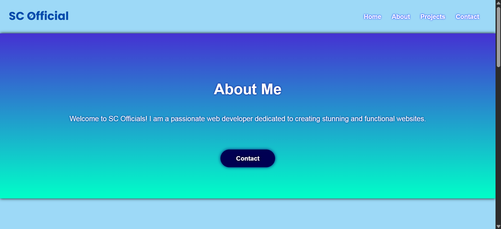

# Demo Portfolio Website  

This is my **first responsive website project** built using **HTML** and **CSS**.  
It’s a demo portfolio website that adapts to different screen sizes (desktop, tablet, and mobile).  

---

## 📸 Thumbnail:

  

---

## ✨ Features  

- Fully responsive design  
- Clean and minimal layout  
- Simple navigation bar  
- Portfolio showcase section  
- Contact section  

---

## 🛠️ Built With  

- **HTML5**  
- **CSS3 (Flexbox & Media Queries)**  

---

## 🚀 Live Demo  

[View Project](https://devscwp.github.io/scofficials-portfolio/)  

---

## 📚 What I Learned  

- How to structure a portfolio website  
- Using **flexbox** for layouts  
- Making a website **responsive** with media queries  
- Improving design using basic CSS styling  

---

## 📌 Future Improvements  

- Add animations and transitions  
- Include more portfolio projects  
- Add JavaScript for interactivity  

---

## 👨‍💻 Author  

**DevSC**  
- GitHub: [Devscwp](https://github.com/Devscwp)  
